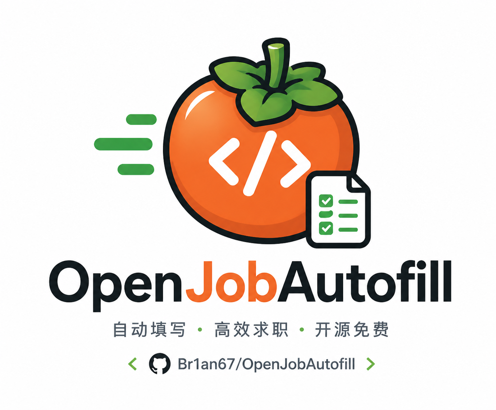

# OpenJobAutofill

[English README](README.en.md)

  

OpenJobAutofill 是一个带 AI 页面分析能力的网申表单填写扩展。你只需要在本机维护一份简历资料，之后打开招聘网站，点击 `开始填写`，它会扫描当前页面，用本地规则和可选 AI 理解字段含义，把能确定的内容填进表单，其他字段标为待处理。

它的重点不是“全自动投递”，而是把 AI 用在最适合的地方：理解不同网站五花八门的字段名称和页面结构，同时把简历具体内容留在本机。个人信息、教育经历、实习经历、项目经历、证书、奖项这些反复填写的内容，都可以交给它先填一遍。最后仍由你自己检查并提交。

如果这个项目帮你节省了网申时间，欢迎给仓库点一个 Star。开源不易，你的反馈也会帮助我继续优化更多招聘网站的兼容性。

## 功能亮点

- 一键扫描当前招聘页面，自动填写能确定的字段，其他字段标为待处理。
- 简历资料只保存在本机，不需要把个人信息上传到云端。
- 支持常见输入框、文本域、单选、多选、下拉框和日期类字段。
- 优化上传附件识别，会把简历附件、证件照、成绩单、作品集等上传项标为待处理，并在结果汇总中提示需要手动选择文件。
- 资料面板可以按分类查看、搜索和手动复制内容，帮助处理橙色待处理字段。
- 可选接入 OpenAI 兼容 API 或自定义 API，帮助理解不同网站的字段含义。
- AI 只辅助识别页面字段和可匹配的资料项，不接收你的简历具体值。
- 页面填写结果会用两种颜色标记：绿色已填写，橙色待处理。
- 支持检查 GitHub Release 更新；有新版本时浏览器图标会显示 `NEW`。

## 安装

当前版本适合以开发者模式安装到 Brave 或 Chrome。

1. 下载或克隆本项目到本机。
2. 打开 `brave://extensions/` 或 `chrome://extensions/`。
3. 开启右上角 `Developer mode`。
4. 点击 `Load unpacked`。
5. 选择项目目录 `OpenJobAutofill`。
6. 固定扩展图标，方便在招聘页面使用。

本项目不需要安装依赖，也不需要构建，加载项目目录即可使用。

## 第一次使用

1. 点击浏览器右上角的 OpenJobAutofill 图标。
2. 点击 `设置`。
3. 在 `简历资料` 中按模块填写你的信息。
4. 点击 `保存资料`，资料会保存到本机浏览器扩展存储。
5. 打开招聘网站的简历填写页或申请表单页。
6. 点击扩展图标，再点击 `开始填写`。
7. 等待扫描和填写完成，根据页面上的绿色/橙色标记检查结果。
8. 对橙色待处理字段，可以打开资料面板搜索并手动复制；对橙色上传项，需要按页面要求手动选择本地文件。
9. 最后由你自己确认页面内容并手动提交。

项目里提供了 `sample-profile.json`，如果你只是想先试一下效果，可以在设置页导入这份示例资料。

## AI 设置

AI 是可选的。不配置 API 时，OpenJobAutofill 仍会使用本地规则尝试匹配和填写字段。

如果你希望它更好地理解不同招聘网站的字段，可以在设置页填写自己的 API 配置。支持 OpenAI 兼容接口，也支持自定义 Base URL、接口路径和模型名。设置页提供 `测试 API 连接` 和 `刷新候选模型`，模型名也可以手动输入，不强依赖自动加载结果。

隐私边界很明确：AI 请求只包含当前页面字段和本机资料字段名称，不包含你的姓名、手机号、身份证号、经历内容等具体资料值。真正的资料取值和填写都在本机完成。

## 更新

插件会定期检查 GitHub Release，也可以在弹窗或设置页手动点击 `检查更新`。如果发现新版本，浏览器图标会显示 `NEW`，点击 `打开 Release 页面` 后按发布页说明下载并覆盖或重新加载扩展。

更新前建议先在设置页点击 `导出资料备份`。更新时不要先卸载扩展；只要保留同一个浏览器扩展，本机保存的简历资料和 API 设置会继续保留。

## 颜色标记

- 绿色：已填写。
- 橙色：待处理，需要你手动处理或复核。

如果页面刷新、进入下一步或动态加载出新的表单，可以再次点击 `开始填写`。

## 上传附件

浏览器安全机制不允许扩展在没有用户选择的情况下直接填入本地文件路径，所以 OpenJobAutofill 不会自动替你上传简历、证件照、成绩单或作品集。

当前版本会专门识别 `input[type="file"]`、上传按钮、附件入口和常见上传文案，把这些项目标为橙色待处理，并在浮层汇总中显示“需上传”的数量。这样可以避免文件上传项被误判成普通文本字段，也能提醒你在最终提交前补齐附件。

## 隐私说明

- 简历资料保存在本机浏览器里。
- API Key 也只保存在本机扩展存储里。
- 页面脚本只会在你点击扩展并操作当前页面后注入。
- 插件不会自动点击最终提交按钮。
- 插件不会自动读取或选择你的本地附件文件，上传项需要你手动选择。
- 插件不会把你的简历具体内容发送给 AI。
- 检查更新只访问本项目的 GitHub Release，不会上传简历资料。
- 页面自动填写后仍建议人工复核，尤其是证件、联系方式、日期、选择题和声明类字段。

## 常见问题

### 点击开始填写没有反应

先刷新目标页面，再重新打开扩展弹窗。如果仍无反应，可以到扩展管理页重载 OpenJobAutofill。

### 为什么有些下拉框或日期填不进去

不同招聘系统的控件实现差异很大。有些控件不是普通输入框，而是复杂组件。遇到这种情况，字段会进入待处理状态，可以用资料面板搜索对应内容并手动选择；如果某类网站经常需要手动处理，欢迎提 Issue，我会优先看可复用的适配方式。

### 多页表单怎么填

每进入一个新页面或新步骤后，再点击一次 `开始填写`。OpenJobAutofill 不会自动跨页面继续填写，也不会自动提交申请。

### 如何备份或迁移资料

在设置页使用 `导出资料备份` 和 `导入资料备份`。导出的文件是 OpenJobAutofill 自己的备份格式，主要用于换浏览器或换电脑时迁移资料。

### 如何清空本机资料

进入设置页，点击 `清空资料和 API 设置`。这会删除当前浏览器里保存的简历资料和 API 配置。

## 反馈

如果你遇到问题、希望适配某个招聘网站，或者有功能建议，欢迎直接提 Issue。反馈时尽量附上网站名称、页面截图、待处理字段描述，这样更容易定位问题。

也可以到我的 GitHub 主页查看公开邮箱联系我。

友情链接：[LINUX DO](https://linux.do) - 一个面向技术爱好者的中文社区，本项目链接并认可 LINUX DO，欢迎佬友交流和反馈。

## License

OpenJobAutofill 使用 MIT License 开源。详见 [LICENSE](LICENSE)。
